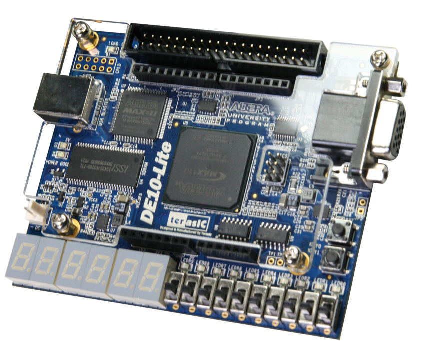

# Simple-Snake

Welcome to Simple Snake, a game running on an FPGA board.

--- 

## Gameplay
You'll start in the top left-hand corner as a dark green square.
At the top right, you'll see a score counter that goes from 0 to 5.

The red circle is the apple you eat to get a point.

When you eat the apple, it takes a second for the game to refresh and for the apple to appear in another cell.

This project was developed using the ALTERA DE10-Lite FPGA board.

The board requires at least two switches and an accelerometer:

- The first switch allows you to pause the game (the rightmost switch, SW0).
- The second switch lets you choose the axis of movement, either vertical or horizontal (the leftmost switch, SW9).
- The accelerometer functions like a spirit level, determining the direction in which the square moves based on the tilt of the controller.

## Context

This project involves the creation of a game on an FPGA, entirely designed and developed by myself. 
The development was completed in just 5 days as part of my academic curriculum, serving as a bonus practical assignment under FPGA.
This work was undertaken after my exam period, allowing me to apply the knowledge gained throughout my academic journey.

## How to play

To determine the direction in which your square will move, use the board as a spirit level. Tilt the board in the direction you want the square to go:

- Tilt the board towards you to move the square down.
- Tilt the board away from you to move the square up.
- Tilt the board to the left to move the square left.
- Tilt the board to the right to move the square right.

Since the accelerometer cannot be accessed on both axes simultaneously, you can switch between axes using switch SW9:

- Set SW9 to '0' (down) for the horizontal axis.
- Set SW9 to '1' (up) for the vertical axis.

Additionally, switch SW0 is used to pause or resume the game:

- Set SW0 to '0' (down) to resume the game.
- Set SW0 to '1' (up) to pause the game.

## Rules
Guide the snake (dark green square) to eat the apple (red circle) to gain a point.
Win the game by eating 5 apples.
The score will automatically reset to 0 after winning.

## Launch the game on your board

To launch the game:

1. Obtain Quartus Prime edition. 
2. Clone the repository. 
3. Compile the project. 
4. Upload the bitstream to a DE10-Lite board. 
5. Connect a VGA cable from the board to a compatible screen.

That's it! Welcome to Snake FPGA Edition.

This project may also be compatible with other boards that have a VGA output and an accelerometer. 
You may need to adjust parameters such as the board pin planner, PLL generator, and update the accelerometer description to match your specific board.