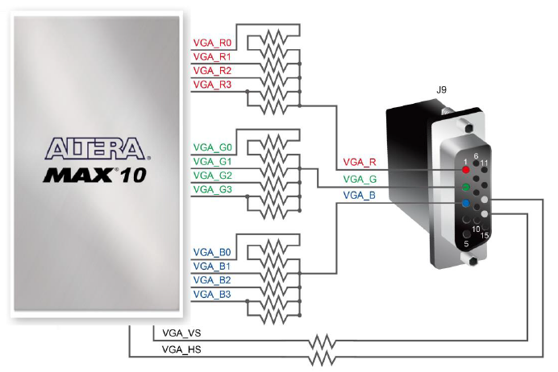
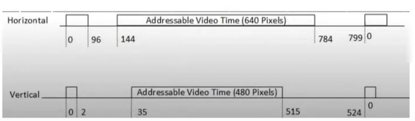
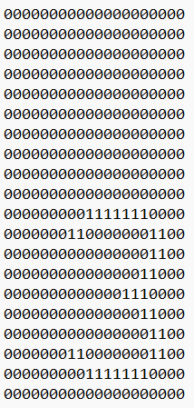
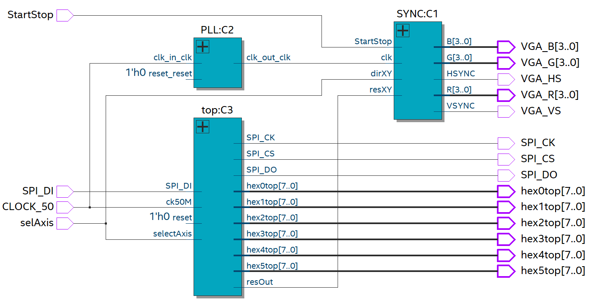

# Simple-Snake

Welcome to Simple Snake, a game running on an FPGA board.

--- 

## Gameplay

You'll start in the top left-hand corner as a dark green square.
At the top right, you'll see a score counter that goes from 0 to 5.

The red circle is the apple you eat to get a point.

When you eat the apple, it takes a second for the game to refresh and for the apple to appear in another cell.

This project was developed using the ALTERA DE10-Lite FPGA board.

The board requires two switches and an accelerometer (ADXL345):

- The first switch allows you to pause the game (the rightmost switch, SW0).
- The second switch lets you choose the axis of movement, either vertical or horizontal (the leftmost switch, SW9).
- The accelerometer functions like a spirit level, determining the direction in which the square moves based on the tilt
  of the controller.

## Context

This project involves the creation of a game on an FPGA, entirely designed and developed by myself.
The development was completed in just 5 days as part of my academic curriculum, serving as a bonus practical assignment
under FPGA.
This work was undertaken after my exam period, allowing me to apply the knowledge gained throughout my academic journey.

## How to play

To determine the direction in which your square will move, use the board as a spirit level. Tilt the board in the
direction you want the square to go:

- Tilt the board towards you to move the square down.
- Tilt the board away from you to move the square up.
- Tilt the board to the left to move the square left.
- Tilt the board to the right to move the square right.

Since the accelerometer cannot be accessed on both axes simultaneously, you can switch between axes using switch SW9:

- Set SW9 to '0' (down) for the horizontal axis.
- Set SW9 to '1' (up) for the vertical axis.

Additionally, switch SW0 is used to pause or resume the game:

- Set SW0 to '0' (down) to resume the game.
- Set SW0 to '1' (up) to pause the game.

## Rules

Guide the snake (dark green square) to eat the apple (red circle) to gain a point.
Win the game by eating 5 apples.
The score will automatically reset to 0 after winning.

## Launch the game on your board

To launch the game:

1. Obtain Quartus Prime edition.
2. Clone the repository.
3. Compile the project.
4. Upload the bitstream to a DE10-Lite board.
5. Connect a VGA cable from the board to a compatible screen.

That's it! Welcome to Snake FPGA Edition.

This project may also be compatible with other boards that have a VGA output and an accelerometer.
You may need to adjust parameters such as the board pin planner, PLL generator, and update the accelerometer description
to match your specific board.

---

The DE10-Lite board includes a VGA output. The VGA synchronization signals are
provided directly from the MAX 10 FPGA, and a 4-bit DAC using resistor network is used to produce the analog data
signals (red, green, and blue). The associated schematic is given below and can support standard VGA resolution
(640x480 pixels, at 25 MHz).

We will have 2 signals to control in order to manage the visual output and we also have 3 RGB signals.

We know our display resolution, which is 640 by 480, but the VGA signal is slightly larger for reasons of front proch,
synchronisation, back porch and finally addressable video bandwidth.

A 25 MHz clock divided by the number of pixels gives a frequency just a bit under 60 Hz.

###

We choose to opt for a 4 by 4 grid, totaling 16 rectangles, as manually
instantiating them is a laborious task. Considering a resolution of 640 by 480, we decided to have rectangles of 160
pixels in the X-axis and 120 pixels in the Y-axis.

By working directly on the VGA signal, we must manually define the conditions to be met for drawing and, indirectly,
choose the pixels to be drawn under certain conditions. The creation of our custom libraries (MY files) standardizes the handling of repetitive shapes. The same applies
to writing because we need to define bitmaps. We have decided to write characters with a resolution of 20 by 20 pixels.
This represents an array of 400 "std_logic" per character. We have limited ourselves to writing "score: 0", with the
number of points ranging from 0 to 5. Below is the image of the number 3 bitmap.

In order to make the user experience more enjoyable and to be able to take control of the associated manipulations
for moving around (X-Y axis, orientation in degrees), we created a clock division using a process this time and not a
PLL (the division factor is too high). This gives a frequency of 1 Hz, or in other words, one movement per second. It
is therefore important to differentiate between the frequencies. The screen refreshes 60 times a second, whereas the
game’s actions take place once a second. So we understand that there is a separation in the VHDL code of the actions to
be carried out according to the frequency in play.

In games, there is often an element of randomness. This is also the case in our game. You have to be able to move
the apple when it’s eaten. This requires a great deal of thought, because the apple has to be able to access all the squares
on the board, as well as the player’s position. To do this, we set up a pseudo-random and assign a new position to the
apple when necessary. As this is a pseudo-random algorithm, certain specific cases lead to the limits of this algorithm.
Indeed, even if we consider the player’s position, it may sometimes happen that the apple finds the same position as
the position where it was eaten, or that we have the impression that the apple follows the rectangle. This is precisely
because of the mathematical limits associated with this homemade randomness.

